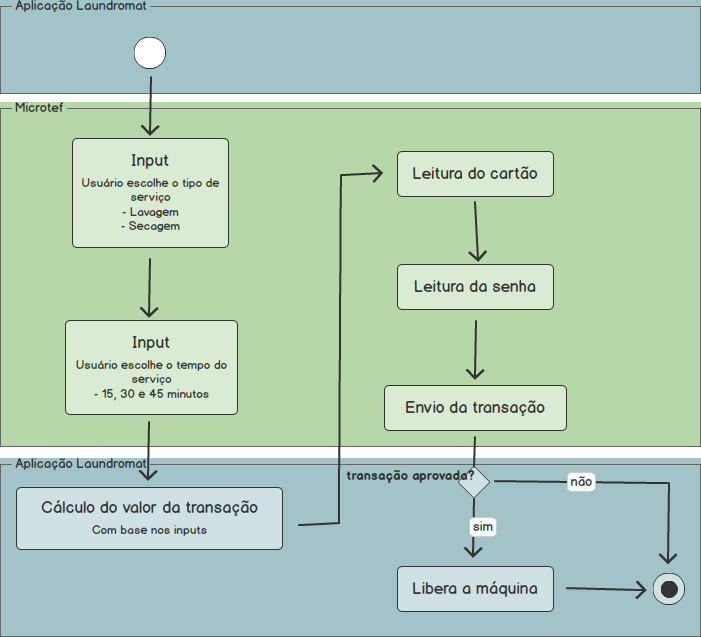

# Laundry prototype

Protótipo de vendas seguindo um _workflow_ de lavanderia, utilizado em um **Raspberry Pi 2, modelo B**.

:warning: Todas as transações aprovadas são canceladas no final do fluxo.

### Workflow

## Dependências

Nome | Utilidade | Link
-----|-----------|------
MicroPos.Uwp.Pack | FAzer conexão com os pinpads, processar e cancelar transações. | [NuGet](https://www.nuget.org/packages/MicroPos.Uwp.Pack/) |

### [:octopus: mail me](mailto:ceres.rohana@gmail.com)
